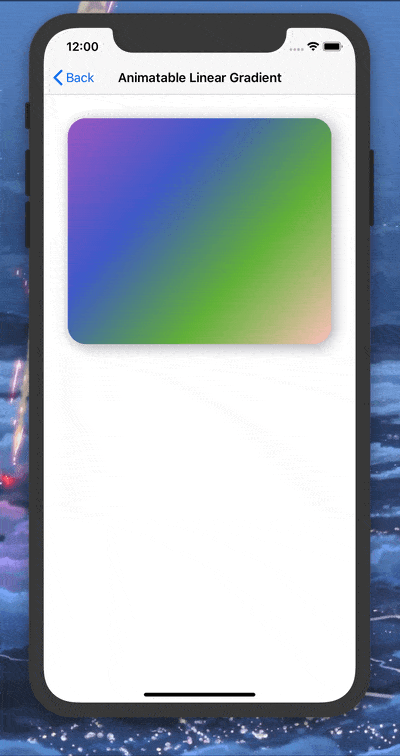

# SwiftUI Animatable Gradients

_A collection of SwiftUI View Modifiers for creating animated color gradients._


<p align="center">
  
  
  
  
  
  <a href="https://github.com/apple/swift-package-manager">
    
  </a>
  <a href="https://github.com/CypherPoet/AnimatableGradients/actions?query=workflow%3ACI">
      
  </a>
  <a href="https://twitter.com/cypher_poet">
    
  </a>
</p>


<div align="center">
  
</div>


- 🔗Clone or download this repo and play around with the [Demo app](./Demo/).
- 🔗Download this [Swift Playgrounds Book](./Assets/Animatable%20Gradients.playgroundbook) to play around with some of the library's underlying code in the [Swift Playgrounds App](https://www.apple.com/swift/playgrounds/).


## Features

- [x] Linear Gradients
- [x] Radial Gradients
- [x] Angular Gradients
- [x] Direct `ViewModifier` Usage on `Shape`s
- [x] Direct `ViewModifier` Usage on `View`s -- when a custom `Shape` is defined.
- [x] Interpolate between as many start and end colors as you want.


## Requirements

- iOS 13.0+
- iPadOS 13.0+
- tvOS 13.0+
- Xcode 11.3+ (for developing)


## Installation

`AnimatableGradients` can be used through the Swift Package Manager. You can add it as a dependency in your `Package.swift` file:

```swift
let package = Package(
    //...
    dependencies: [
        .package(url: "https://github.com/CypherPoet/AnimatableGradients", from: "0.1.1"),
    ],
    //...
)
```

Then simply `import AnimatableGradients` wherever you’d like to use it.


## Usage

The view modifiers exposed by `AnimatableGradients` all conform to its `AnimatableGradientModifier` protocol. (You can view the implementation [here](https://github.com/CypherPoet/AnimatableGradients/blob/master/Sources/Protocols/AnimatableGradientModifier.swift).)

<details>
<summary>AnimatableGradientModifier Protocol</summary>

```swift
protocol AnimatableGradientModifier: AnimatableModifier {
    associatedtype BaseShape: Shape
    associatedtype GradientShapeStyle: ShapeStyle

    var baseShape: BaseShape { get }
    var startColors: [UIColor] { get }
    var endColors: [UIColor] { get }

    var completionPercentage: CGFloat { get set }

    func gradientFill(in geometry: GeometryProxy) -> GradientShapeStyle
}

```

</details>


To use these modifiers, `AnimatableGradients` provides the following extensions on `View`s and `Shape`s:

- animatableLinearGradient
- animatableRadialGradient
- animatableAngularGradient

(More detailed explanations of each can be found below.)

🔑 In order to achieve animation, your containing views will need to provide the aforementioned modifiers with a bound `CGFloat` state value that ranges between 0.0 and 1.0.

```swift
@State private var animationCompletion: CGFloat = 0.0
```

> This is the "animation completion" percentage that each `AnimatableGradientModifier` will use to generate interpolated color values during each rendered frame.


Additionally, the same containing views will need to animate the change of the animation completion. A common pattern consists of animating the value repeatedly from the containing view's `onAppear` modifier to create a continuous animation effect:

```swift
.onAppear {
    withAnimation(
        Animation.easeInOut(duration: 1.0).repeatForever(autoreverses: true)
    ) {
        self.animationCompletion = 1.0
    }
}
```

Taken together, a minimal functional example could look like this:

```swift
struct ContentView {
    @State private var animationCompletion: CGFloat = 0.0

    var body: some View {
        RoundedRectangle(cornerRadius: 24)
            .animatableLinearGradient(
                startColors: [.red, .blue],
                endColors: [.green, .yellow],
                completionPercentage: animationCompletion
            )
            .onAppear {
                withAnimation(
                    Animation.easeInOut(duration: 1.0).repeatForever(autoreverses: true)
                ) {
                    self.animationCompletion = 1.0
                }
            }
    }
}
```

But now for some more detail...


### Animatable Linear Gradients

#### Usage on Shapes

```swift
extension Shape {

    public func animatableLinearGradient (
        startColors: [UIColor],
        endColors: [UIColor],
        startPoint: UnitPoint = .topLeading,
        endPoint: UnitPoint = .bottomTrailing,
        completionPercentage: CGFloat
    ) -> some View {
      ...
    }
}
```
<div align="center">What you're using 👆</div>
</br>


```swift
RoundedRectangle(cornerRadius: 24)
    .animatableLinearGradient(
        startColors: [.systemPurple, .systemBlue, .systemGreen, .white],
        endColors: [.systemGray, .systemPink, .systemOrange, .systemRed],
        completionPercentage: animationCompletion
    )
```
<div align="center">How you might use it 👆</div>
<br />


#### Usage on Views

```swift
extension View {

    public func animatableLinearGradient<BaseShape: Shape>(
        baseShape: BaseShape,
        startColors: [UIColor],
        endColors: [UIColor],
        startPoint: UnitPoint = .topLeading,
        endPoint: UnitPoint = .bottomTrailing,
        completionPercentage: CGFloat
    ) -> some View {
      ...
    }
}
```
<div align="center">What you're using 👆</div>
</br>


```swift
Color.clear
    .animatableLinearGradient(
            baseShape: RoundedRectangle(cornerRadius: 24),
            startColors: [.systemPurple, .systemBlue, .systemGreen, .white],
            endColors: [.systemGray, .systemPink, .systemOrange, .systemRed],
            completionPercentage: animationCompletion
    )
```
<div align="center">How you might use it 👆</div>
<br />


#### 📸 Example

<div align="center">
  
</div>


### Animatable Radial Gradients

#### Usage on Shapes

```swift
extension Shape {

   public func animatableRadialGradient (
        startColors: [UIColor],
        endColors: [UIColor],
        centerPoint: UnitPoint = .center,
        startRadius: CGFloat? = nil,
        endRadius: CGFloat? = nil,
        completionPercentage: CGFloat
    ) -> some View {
        ...
    }
}
```
<div align="center">What you're using 👆</div>
</br>


```swift
RoundedRectangle(cornerRadius: 24)
    .animatableRadialGradient(
        startColors: [.systemPurple, .systemBlue, .systemGreen, .white],
        endColors: [.systemGray, .systemPink, .systemOrange, .black],
        completionPercentage: animationCompletion
    )
```
<div align="center">How you might use it 👆</div>
</br>


#### Usage on Views

```swift
extension View {

    public func animatableRadialGradient<BaseShape: Shape>(
        baseShape: BaseShape,
        startColors: [UIColor],
        endColors: [UIColor],
        centerPoint: UnitPoint = .center,
        startRadius: CGFloat? = nil,
        endRadius: CGFloat? = nil,
        completionPercentage: CGFloat
    ) -> some View {
        ...
    }
}
```
<div align="center">What you're using 👆</div>
</br>


```swift
Color.clear
    .animatableRadialGradient(
        baseShape: RoundedRectangle(cornerRadius: 24),
        startColors: [.systemPurple, .systemBlue, .systemGreen, .white],
        endColors: [.systemGray, .systemPink, .systemOrange, .black],
        completionPercentage: animationCompletion
    )
```
<div align="center">How you might use it 👆</div>
</br>


#### 📸 Example

<div align="center">
  
</div>


### Animatable Angular Gradients

#### Usage on Shapes

```swift
extension Shape {

    /// - Parameters:
    ///   - fullSpanStartAngle: Setting this property will cause the gradient to being at
    ///         the specified offset, and then span the entire circumference. (Default: `nil`)
    public func animatableAngularGradient (
        startColors: [UIColor],
        endColors: [UIColor],
        centerPoint: UnitPoint = .center,
        fullSpanStartAngle: Angle,
        completionPercentage: CGFloat
    ) -> some View {
        ...
    }


    public func animatableAngularGradient (
        startColors: [UIColor],
        endColors: [UIColor],
        centerPoint: UnitPoint = .center,
        startAngle: Angle = .zero,
        endAngle: Angle = .radians(2 * .pi),
        completionPercentage: CGFloat
    ) -> some View {
        ...
    }
}
```
<div align="center">What you're using 👆</div>
</br>


```swift
RoundedRectangle(cornerRadius: 24)
    .animatableAngularGradient(
        startColors: [.systemPurple, .systemBlue, .systemGreen, .white],
        endColors: [.systemGray, .systemPink, .systemOrange, .systemRed],
        completionPercentage: animationCompletion
    )
```
<div align="center">How you might use it 👆</div>
</br>


#### Usage on Views

```swift
extension View {

    /// - Parameters:
    ///   - fullSpanStartAngle: Setting this property will cause the gradient to being at
    ///         the specified offset, and then span the entire circumference. (Default: `nil`)
    public func animatableAngularGradient<BaseShape: Shape>(
        baseShape: BaseShape,
        startColors: [UIColor],
        endColors: [UIColor],
        centerPoint: UnitPoint = .center,
        fullSpanStartAngle: Angle,
        completionPercentage: CGFloat
    ) -> some View {
        ...
    }


    public func animatableAngularGradient<BaseShape: Shape>(
        baseShape: BaseShape,
        startColors: [UIColor],
        endColors: [UIColor],
        centerPoint: UnitPoint = .center,
        startAngle: Angle = .zero,
        endAngle: Angle = .radians(2 * .pi),
        completionPercentage: CGFloat
    ) -> some View {
        ...
    }
}
```
<div align="center">What you're using 👆</div>
</br>


```swift
Color.clear
    .animatableAngularGradient(
        baseShape: RoundedRectangle(cornerRadius: 24),
        startColors: [.systemPurple, .systemBlue, .systemGreen, .white],
        endColors: [.systemGray, .systemPink, .systemOrange, .systemRed],
        completionPercentage: animationCompletion
    )
```
<div align="center">How you might use it 👆</div>
</br>


#### 📸 Example

<div align="center">
  
</div>


### ⚠️ Edge Cases

- If you pass a `completionPercentage` value less than 0, or greater than 1, it will automatically be clamped to the closer endpoint.
- Behind the scenes, the `startColors` and `endColors` arrays get zipped before the interpolated colors are computed. This means that if their sizes are different, the larger array will be trimmed down to the size of the smaller array, and the excess colors in the larger array won't be used.
  - As such, if either or both of the `startColors` and `endColors` arrays are empty, the gradient will have no colors passed to it and it will appear completely clear.


## Contributing

Contributions to `AnimatableGradients` are most welcome. Check out some of the [issue templates](./.github/ISSUE_TEMPLATE/) for more info.


## Roadmap

- Mac Catalyst Support (?)
- watchOS Support (?)


## License

AnimatableGradients is available under the MIT license. See the [LICENSE file](./LICENSE) for more info.
